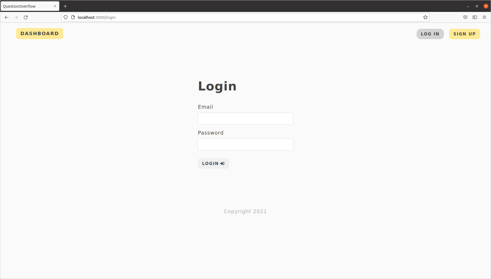
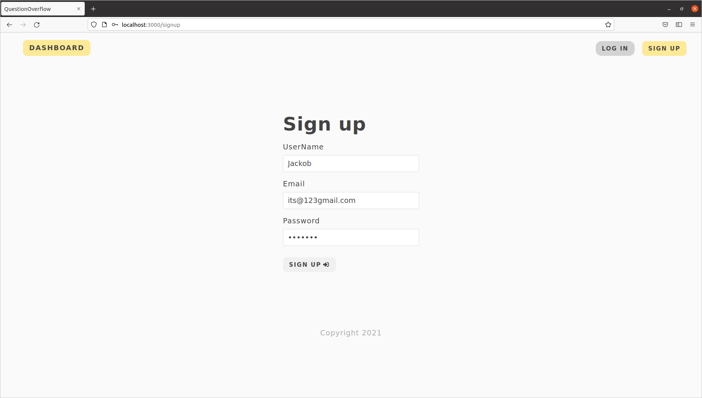
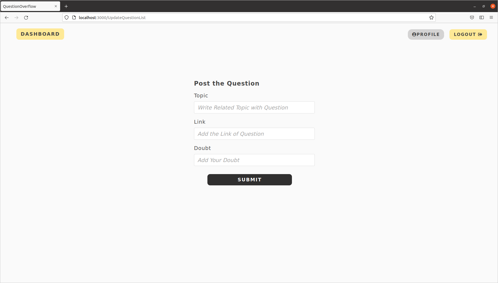
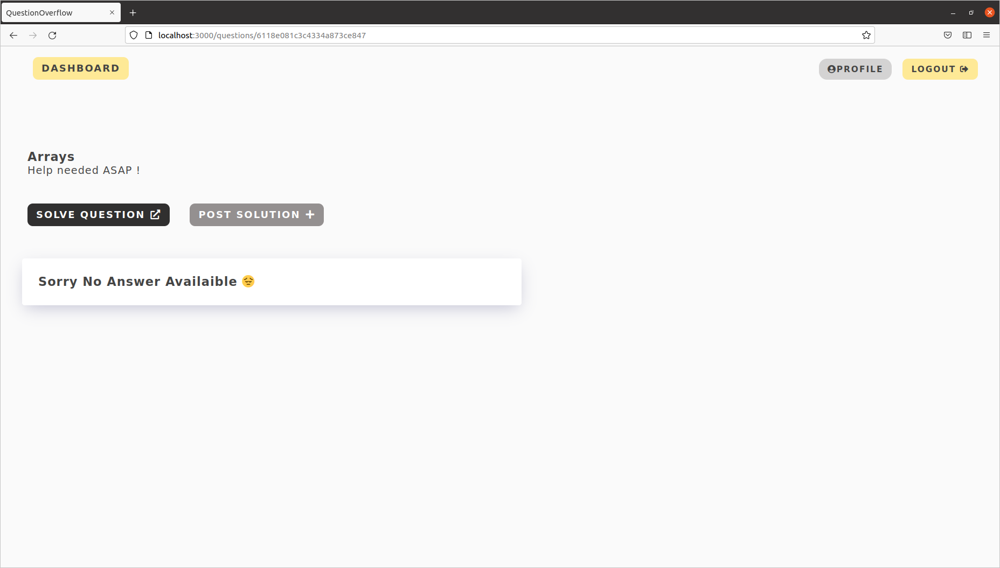
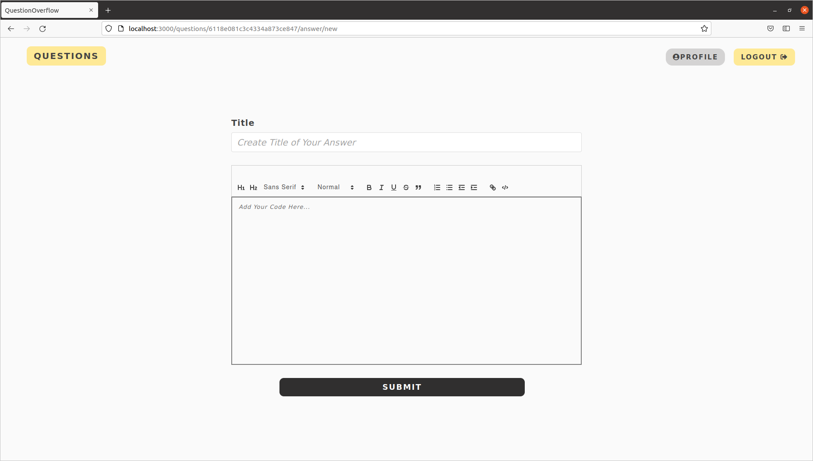

# QuestionOverflow

### Starting Face for the Project :

1. npm init
2. install all dependencies
```
bcrypt
body-parser
cookie-parser
ejs
express
jsonwebtoken
mongoose
validator
```
3. nodemon : npm install nodemon -g
4. changes to be made : in package.json file

```
"scripts": {
    "start": "node app.js",
    "devStart": "nodemon app.js",
    "test": "echo \"Error: no test specified\" && exit 1"
  }
```
5. to run our server : npm run devStart
----
### HomePage of Web-Application :

### LoginScreen :

### SignUp Screen :

### Adding Question Screen :

### Display Questions and Related Answers :

### Adding Answer to a Question :

### Profile Page of a User :


---
### API's Build in Project :
```
COMING SOON
```
---
### Working Snippet of Project :

[LINK TO SNIPPET](https://youtu.be/avdqq_EHqmk)

---

### Some Doubts that I face during working on this project:

```
Is it possible to do a POST from just an <a> tag?
I know anchor tags are usually just for GETs, and I know
I can use javascript to do this (like in JavaScript post
request like a form submit) but to me that seems a little messy.
Is there a way to do this with straight HTML?

ANSWER :

Simple answer: no. You need to use javascript to do this kind of thing;
since when you do a POST what you're doing is sending the data in the HTTP request.
With get you're just sending it as part of the string (thus you can do it through the
href value).
```

```
mereko question k particular answer k sare comments show krne
the and i was not able to send 2 objects to site like answer.id ,
comments.id to same api , that why I change my connection startegy modles of answer and comment.
```

```
The JWT tokens are immutable so you can't change/update claims on an existing token - thus you have to issue a new JWT token.

That leads to the biggest problem with JWT - token revocation. There are no good solutions. What you can do is

Keep JWT expiration date short (and optionally use refresh tokens)

Use a blacklist to keep a list of revoked tokens (of course losing the 'stateless' part this way)

change the secret key (keep in mind that this revokes ALL valid tokens of all users)

The best solution depends on the concrete case.
```
